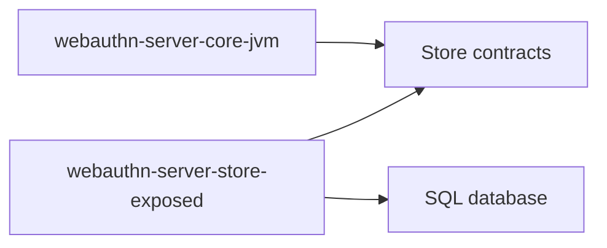

# webauthn-server-store-exposed

Exposed-backed persistence adapters for server-core store contracts.

## What it provides

- `ExposedChallengeStore`
- `ExposedCredentialStore`
- `ExposedUserAccountStore`
- `initializeWebAuthnSchema(database)` bootstrap helper

## When to use

Use this when your JVM backend already uses Exposed/JDBC and you want persistent WebAuthn state.

## How to use

```kotlin
import dev.webauthn.server.store.exposed.ExposedChallengeStore
import dev.webauthn.server.store.exposed.ExposedCredentialStore
import dev.webauthn.server.store.exposed.ExposedUserAccountStore
import dev.webauthn.server.store.exposed.initializeWebAuthnSchema

initializeWebAuthnSchema(database)

val challengeStore = ExposedChallengeStore(database)
val credentialStore = ExposedCredentialStore(database)
val userStore = ExposedUserAccountStore(database)
```

Real-world scenario: replace in-memory stores in production so ceremonies survive process restarts and can scale horizontally.

## How it fits



## Pitfalls and limits

- You still own migrations, backup, and operational DB concerns.
- Schema/bootstrap is not a substitute for full lifecycle migration tooling in mature deployments.

## Status

Beta, contract-tested Exposed storage adapter.
March 2026: readability/style pass only (vertical chaining and `::` adoption where clearer); no API or behavior change.
